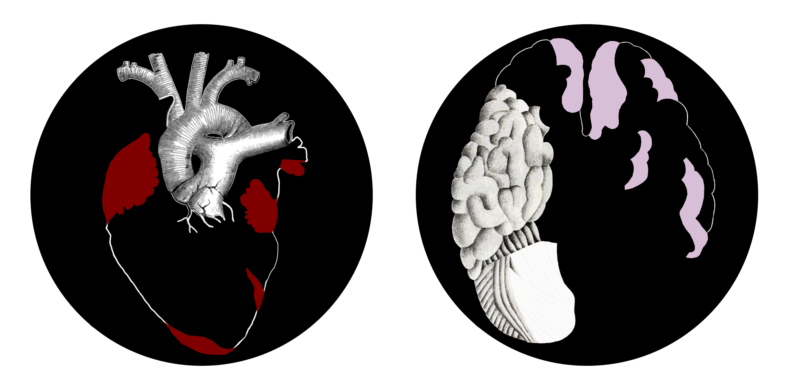
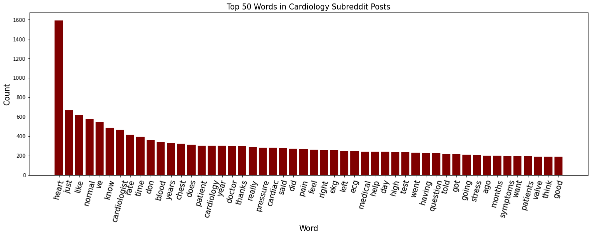
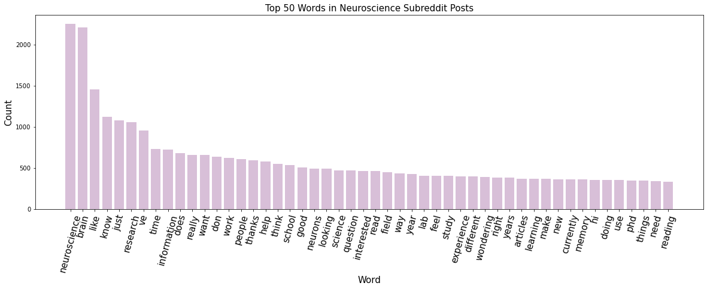
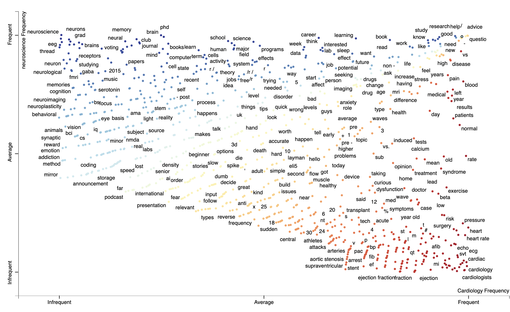
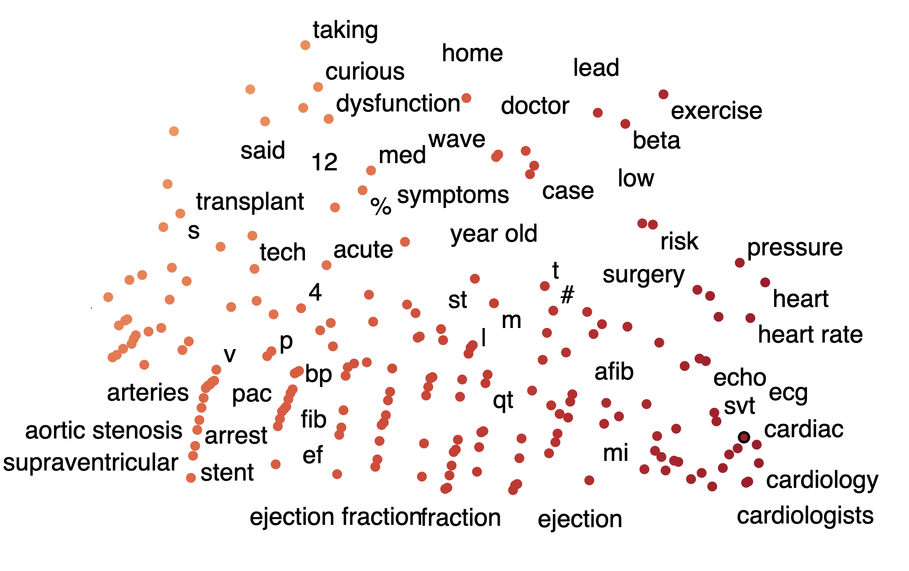
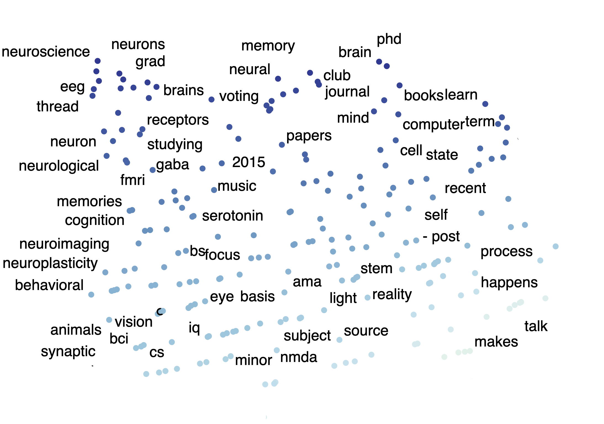
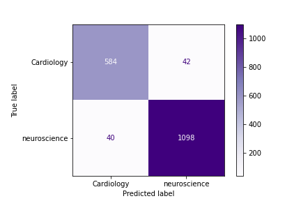

#  

# Project 3: MINDS THAT SPEAK, HEARTS THAT LISTEN

    
### Problem Statement:
Research campuses experience departmental isolation. Unfortunately, many research breakthroughs come about through collaboration and interdepartmental discourse, which is largely hampered by the separation of different disciplines. 

Interdepartmental discourse can happen in public through publications and conferences, but most discourse occurs in private and in less polished public friendly formats. A lot of this private correspondance happens through private institutional channels and therefore is accessible to the greater research institute at large for better understanding of inderdepartmental research. 

Better auto-categorization of passive interdepartmental discourse could accelerate the occurance of collaborative breakthroughs most important to research and the development of knowledge.

Furthermore, many researchers determine the key words for their own research but often have blind spots about the applicability of their work to other disciplines. Better auto-categorization could give us clues about intersecting interest and could aid in the encouragement of better environments of collaboration.

##### This investigation here asks, can a community text bank like reddit be used to create a model for differentiating disciplines from each other? Can this investigation reveal key words that exist at the overlap and extremities of these disciplines?

    
### Analysis:

- Using an API, thousands of posts were scraped from two subreddits, r/Cardiology and r/neuroscience. 
- Text from the posts and post titles were organized, cleaned, and vectorized.
- The subsequent word counts were used to build a better understanding of the intersections and extremities of these communities.
- Neuroscience posts and titles appear to be slightly longer on average than those from the Cardiology subreddit, but not significantly so.

 
- The above bar plot shows the top 50 unigrams from all collected post text from r/Cardiology subreddit.
- The top 6 words include 'heart', 'just', 'like', 'normal', 'know', and 'cardiologist'.

 
- The above bar plot shows the top 50 unigrams from all collected post text from r/neuroscience subreddit.
- The top 6 words include 'neuroscience', 'just', 'like', 'research', 'know', and 'brain'.

 
 - The above plot is a very interesting scattertext plot showing frequency and overlap of many terms from the combined text landscape of both subreddits.
- Words in top right corner are those very common in both subreddits (e.g. 'research', 'help','advice', etc.), while words approaching the bottom left corner are those that are most rare but equally present in both subreddits (e.g. 'ai', 'fear', 'podcast', 'spike', etc.).
- Plot exists as an interactive html file in main repository.

 
 - Here is a zoom in on the above plot showing the words in bottom right corner.
 - These are those that are most essentially of cardiology (e.g. 'echo','ecg', etc.).
 
 
- Here is a zoom in on the above plot showing the words in top left corner.
- Words in top left corner are those that are most essentially neuroscience (e.g.'eeg','brains', etc.). 

- After a slight tweak to the first ensemble model, this is the confusion matrix of the improved best performing model.
- This model is a count vectorized voting classified model consisting of unevenly weighted logistic regression, random forest, and naive bayes estimators. 
- This ensemble model is the best performing model. 

    
### Conclusion:
Subreddits, as initial sources of community language, prove to be exceptionally strong source datasets for creating models that accurately predict and classify research community discourse. These models, in combination with others built from internal institutional source text could be used to auto-categorize internal correspondance.

Misclassification seem to occur because post content has nothing to do with either neuroscience or cardiology (e.g. "hello"), because a strong word of one discipline outweighs a weaker word from another (e.g. "blood" is stronger than "mri"), or because the only keywords a post contains are words that are heavily used by both communities (e.g. "stroke", "research", etc.) It is in these middle confusion areas where the greatest potential for future classification analyis or future departmental intersectionality perhaps may be found.  

    
### Sources:
- https://www.reddit.com/r/Cardiology/

- https://www.reddit.com/r/neuroscience/

- https://github.com/JasonKessler/scattertext